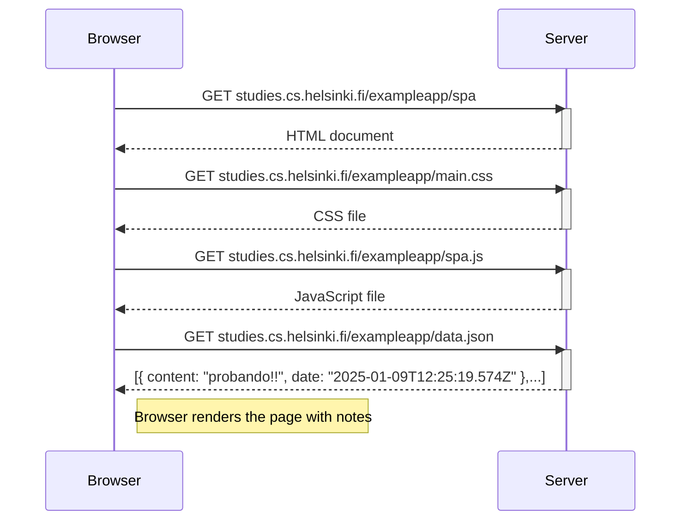

```mermaid
sequenceDiagram
participant browser as Browser
participant server as Server

    browser->>server: GET studies.cs.helsinki.fi/exampleapp/spa
    activate server
    server-->>browser: HTML document
    deactivate server

    browser->>server: GET studies.cs.helsinki.fi/exampleapp/main.css
    activate server
    server-->>browser: CSS file
    deactivate server

    browser->>server: GET studies.cs.helsinki.fi/exampleapp/spa.js
    activate server
    server-->>browser: JavaScript file
    deactivate server

    browser->>server: GET studies.cs.helsinki.fi/exampleapp/data.json
    activate server
    server-->>browser: [{ content: "probando!!", date: "2025-01-09T12:25:19.574Z" },...]
    deactivate server

    Note right of browser: Browser renders the page with notes

```