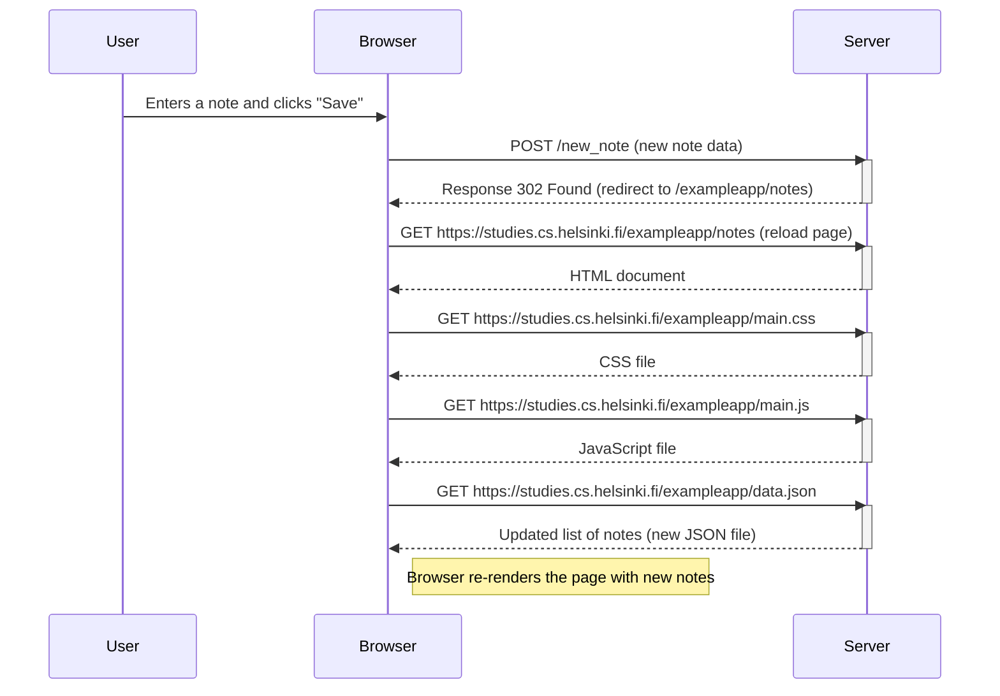

```mermaid
sequenceDiagram
participant user as User
participant browser as Browser
participant server as Server

    user->>browser: Enters a note and clicks "Save"
    browser->>server: POST /new_note (new note data)
    activate server
    server-->>browser: Response 302 Found (redirect to /exampleapp/notes)
    deactivate server

    browser->>server: GET https://studies.cs.helsinki.fi/exampleapp/notes (reload page)
    activate server
    server-->>browser: HTML document
    deactivate server

    browser->>server: GET https://studies.cs.helsinki.fi/exampleapp/main.css
    activate server
    server-->>browser: CSS file
    deactivate server

    browser->>server: GET https://studies.cs.helsinki.fi/exampleapp/main.js
    activate server
    server-->>browser: JavaScript file
    deactivate server

    browser->>server: GET https://studies.cs.helsinki.fi/exampleapp/data.json
    activate server
    server-->>browser: Updated list of notes (new JSON file)
    deactivate server

    Note right of browser: Browser re-renders the page with new notes
```