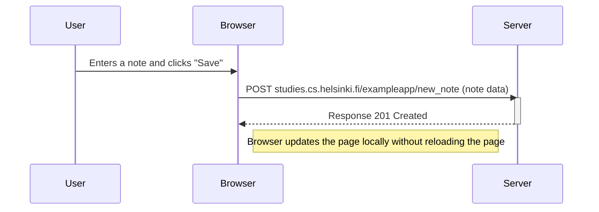

```mermaid

sequenceDiagram
    participant user as User
    participant browser as Browser
    participant server as Server

    user->>browser: Enters a note and clicks "Save"
    browser->>server: POST studies.cs.helsinki.fi/exampleapp/new_note (note data)
    activate server
    server-->>browser: Response 201 Created
    deactivate server

    Note right of browser: Browser updates the page locally without reloading the page

```